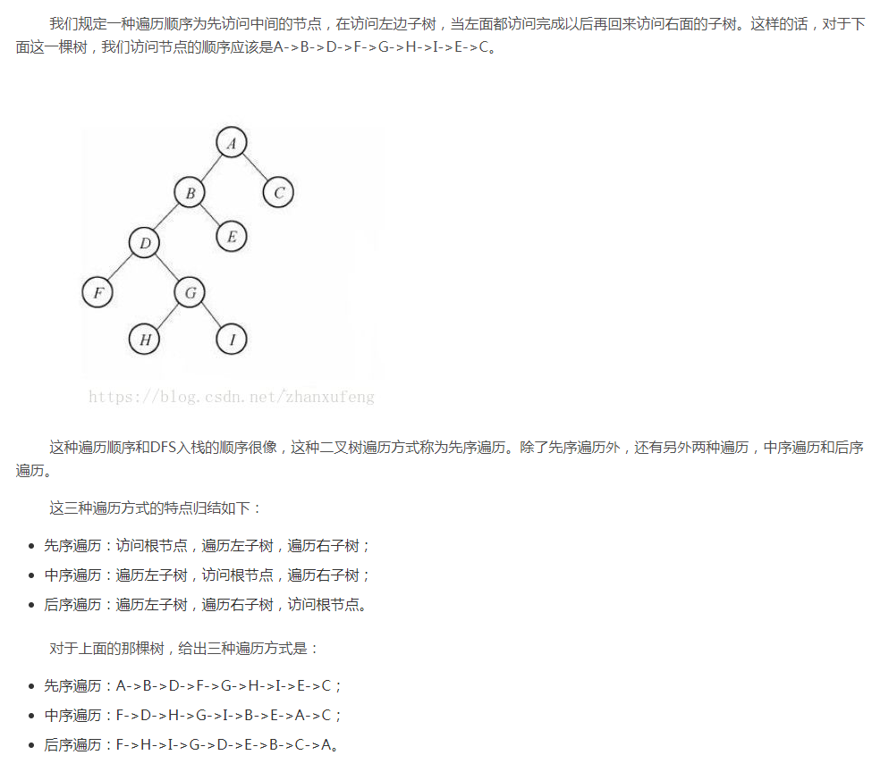

# 树的相关知识


## 树的基本概念和遍历

- [参考](https://www.cnblogs.com/myjavascript/articles/4092746.html, "树的基本介绍")




- 满二叉树：高度为h，由2^h-1个节点构成的二叉树称为满二叉树。

  

- 完全二叉树是由满二叉树而引出来的。对于深度为K的，有n个结点的二叉树，当且仅当其每一个结点都与深度为K的满二叉树中编号从1至n的结点一一对应时称之为完全二叉树。

  若设二叉树的深度为h，除第 h 层外，其它各层 (1～h-1) 的结点数都达到最大个数，第h 层所有的结点都连续集中在最左边，这就是完全二叉树。

  （大家好好理解一下上面两个定义，是等价的~~）

  满二叉树一定是完全二叉树，完全二叉树不一定是满二叉树。

  |           | 完全二叉树             | 满二叉树      |
  | --------- | ---------------------- | ------------- |
  | 总结点n   | 2^(h -1) < n < 2^h - 1 | n = 2^h - 1   |
  | 树的高度h | h = log2 n  + 1        | h =log2 (n+1) |

  

- 二叉排序树又叫二叉查找树或者二叉搜索树，它首先是一个二叉树，而且必须满足下面的条件：

  1）若左子树不空，则左子树上所有结点的值均小于它的根节点的值；

  2）若右子树不空，则右子树上所有结点的值均大于它的根结点的值

  3）左、右子树也分别为二叉排序树

  4）没有键值相等的节点（？可能是因为不好处理键值相等的节点到底是左节点还是右节点吧）

- 平衡二叉树（AVL），它是一种排序二叉树， 一 棵空树或它的左右两个子树的高度差的绝对值不超过1，并且左右两个子树都是一棵平衡二叉树，可以防止排序二叉树蜕变成链表算法复杂度成为n。

- 红黑树，他是一种平衡二叉树，为了减少avl树在添加或者删除节点的时候自旋次数。

## 树的常见算法

- [参考](https://www.cnblogs.com/manji/p/4903990.html)

- 节点定义(**都是以二叉树为例子**)

  ```go
  type Node struct {
  	Left *Node
  	Right *Node
  	Value int
  }
  ```


- 树的高度

  ```go
  func (lst *Node) Height() int {
  	if lst == nil {
  		return 0
  	}
  
  	lh := lst.Left.Height() + 1
  	rh := lst.Right.Height() + 1
  	if lh < rh {
  		return rh
  	}
  	return lh
  }
  ```

  

- 完全二叉树生成

  ```go
  //按照完全二叉树插入
  func (lst *Node) InsertAsComplete(node *Node){
  	if node == nil {
  		return
  	}
  
  	if lst.Left == nil {
  		lst.Left = node
  		return
  	}
  
  	if lst.Right == nil {
  		lst.Right = node
  		return
  	}
  
  	lh, lNode := 0, lst.Left
  	for lNode != nil {
  		lNode = lNode.Right
  		lh++
  	}
  
  	rh, rNode := 0, lst.Right
  	for rNode != nil {
  		rNode = rNode.Right
  		rh++
  	}
  
  	if lh != rh {
  		lst.Right.InsertAsComplete(node)
  	} else {
  		lst.Left.InsertAsComplete(node)
  	}
  }
  
  //树的节点数
  func (lst *Node) NodeNum() int {
  	if lst == nil {
  		return 0
  	}
  
  	num := 1
  	num += lst.Left.NodeNum()
  	num += lst.Right.NodeNum()
  	return num
  }
  
  ```

  

- 先序 中序 后序 算法

  ```go
  func (lst *Node) PreScanNode() (ret []int) {
  	if lst == nil {
  		return
  	}
  
  	if ret == nil {
  		ret = []int{}
  	}
  
  	ret = append(ret, lst.Value)
  	lret := lst.Left.PreScanNode()
  	rret := lst.Right.PreScanNode()
  	if lret != nil {
  		ret = append(ret, lret...)
  	}
  
  	if rret != nil {
  		ret = append(ret, rret...)
  	}
  
  	return
  }
  
  func (lst *Node) MidScanNode() (ret []int) {
  	if lst == nil {
  		return
  	}
  
  	if ret == nil {
  		ret = []int{}
  	}
  
  	lret := lst.Left.MidScanNode()
  	if lret != nil {
  		ret = append(ret, lret...)
  	}
  
  	ret = append(ret, lst.Value)
  
  	rret := lst.Right.MidScanNode()
  	if rret != nil {
  		ret = append(ret, rret...)
  	}
  
  	return
  }
  
  func (lst *Node) LastScanNode() (ret []int) {
  	if lst == nil {
  		return
  	}
  
  	if ret == nil {
  		ret = []int{}
  	}
  
  	lret := lst.Left.LastScanNode()
  	if lret != nil {
  		ret = append(ret, lret...)
  	}
  
  	rret := lst.Right.LastScanNode()
  	if rret != nil {
  		ret = append(ret, rret...)
  	}
  
  	ret = append(ret, lst.Value)
  
  	return
  }
  
  
  ```

  

  

## 平衡二叉树

- AVL 

  [参考](http://www.cnblogs.com/skywang12345/p/3577479.html)

  [参考2](https://blog.csdn.net/rookie_ly/article/details/80473482)

  ```go
  type AvlNode struct {
  	Left *AvlNode
  	Right *AvlNode
  	Value int
  }
  
  
  func (lst *AvlNode) Height() int {
  	if lst == nil {
  		return 0
  	}
  
  	h := lst.Left.Height()
  	h2 := lst.Right.Height()
  	if h > h2 {
  		h = h2
  	}
  	return h
  }
  
  //右转 插入左子树的左节点
  func (lst *AvlNode) R_Rotation() *AvlNode {
  	root := lst.Left
  	lst.Left = root.Right
  	root.Right = lst
  	return root
  }
  
  //左转 插入右子树的右节点
  func (lst *AvlNode) L_Rotation() *AvlNode {
  	root := lst.Right
  	lst.Right = root.Left
  	root.Left = lst
  	return root
  }
  
  //右左 插入右子树的左节点
  func (lst *AvlNode) RL_Rotation() *AvlNode {
  	lst.Right = lst.Right.R_Rotation()
  	return lst.L_Rotation()
  }
  
  //左右 插入左子树的右节点
  func (lst *AvlNode) LR_Rotation() *AvlNode {
  	lst.Left = lst.Left.L_Rotation()
  	return lst.R_Rotation()
  }
  
  func (lst *AvlNode) Insert(node *AvlNode) (error, *AvlNode) {
  	var err error
  	if lst == nil {
  		return nil, node
  	}
  
  	if node == nil {
  		return nil, lst
  	}
  
  	if node.Value == lst.Value {
  		return fmt.Errorf("repeate value:%d", node.Value), nil
  	}
  
  	if node.Value < lst.Value { //左子树
  		err, lst.Left = lst.Left.Insert(node)
  		if err != nil {
  			return err, lst
  		}
  
  		lh, rh := lst.Left.Height(), lst.Right.Height()
  		if lh - rh == 2 {
  			if node.Value < lst.Left.Value { //右右
  				return nil, lst.R_Rotation()
  			} else { //左右
  				return nil, lst.LR_Rotation()
  			}
  		}
  		return nil, lst
  
  	} else { //右子树
  		err, lst.Right = lst.Right.Insert(node)
  		if err != nil {
  			return err, lst
  		}
  
  		lh, rh := lst.Left.Height(), lst.Right.Height()
  		if rh - lh == 2 {
  			if node.Value > lst.Right.Value { //左左
  				return nil, lst.L_Rotation()
  			} else { //右左
  				return nil, lst.RL_Rotation()
  			}
  		}
  
  		return nil, lst
  	}
  }
  
  ```

  

- 红黑树

  红黑树和avl树类似，都是在进行插入和删除操作时通过特定的操作保持二叉树的平衡，从而获得较高的查找性能。

  特点：

        1.节点是红色或黑色
        
        2.根节点是黑色
        
        3.叶子节点（nil,空节点）是黑色
        
        4.每个红色节点的两个子节点都是黑色


## B树

- B(B-)和B+树的区别

  [参考](https://blog.csdn.net/qq_26222859/article/details/80631121)

  [参考](https://www.cnblogs.com/vincently/p/4526560.html)

  - 区别如下图

    

    **B+树的特征：**

    1.有k个子树的中间节点包含有k个元素（B树中是k-1个元素），每个元素不保存数据，只用来索引，所有数据都保存在叶子节点。

    2.所有的叶子结点中包含了全部元素的信息，及指向含这些元素记录的指针，且叶子结点本身依关键字的大小自小而大顺序链接。

    3.所有的中间节点元素都同时存在于子节点，在子节点元素中是最大（或最小）元素。

    

    **B+树的优势：**

    1.单一节点存储更多的元素，使得查询的IO次数更少。

    2.所有查询都要查找到叶子节点，查询性能稳定。

    3.所有叶子节点形成有序链表，便于范围查询。

    

- 
- 


------

- [目录](pre.md)
- [上一章](2.1.md)
- [下一章](2.2.md)

