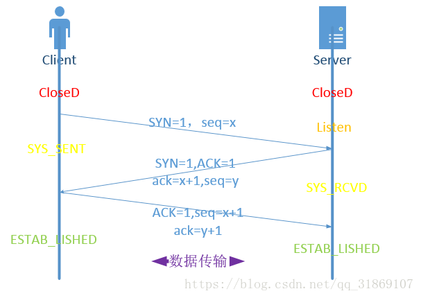
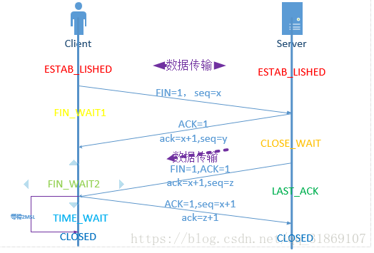

## tcp三次握手和四次挥手 [参考](https://blog.csdn.net/qq_31869107/article/details/81327494)

### 基本概念

   我们需要掌握哪些标志量

- SYN：请求同步标志，为1的时候为有效 
- ACK：应答标志，表示接受到所发的数据，1为有效 
- FIN：结束请求标志，1为有效

  ack：应答，值为告诉对方下一次所发数据地址 
  seq：值为所发数据地址

### 三次握手

​	根据图片所示： 
​	客户机主动唤醒处在Listen状态下的服务器，发送：SYN=1,seq=x表示请求同步，所发数据地址为x 
​	当服务器接收到数据后，返回：SYN=1，ACK=1，seq=y,ack=x+1（合并的步骤），表示同步请求恢复，收到	客户机所发数据，服务器发送数据地址为y，提醒客户机该发送地址为x+1的数据 
​	接收到服务器反馈后客户机进行应答：ACK=1，seq=x+1，ack=y+1,表示接受到所发消息，本次数据地址为	x+1，提醒服务器下次应发y+1地址的数据

### 四次挥手

- 对照图片将哈： 
  首先客户机是主动发起断开连接请求的（结合实际也能理解），向服务器发送：FIN=1，seq=x，表示客户机向服务器发送断开连接的申请标志位，客户机所发送数据地址为x 
  服务器接收到数据后，ACK=1,seq=y,ack=x+1,这个就不解释了吧，但需要对比握手操作的是为什么后面服务器还发送了一次，而不是将两步合为一步，因为在服务器接收到客户机的断开请求后，可能还有些数据正在传输或未传输且需要传输，因此服务器先回复客户机表示接收到你的断开请求但还不能够断开，当数据传输完成后再次回复FIN=1,ACK=1,seq=z,ack=x+1表示可以断开了，注意这时seq变为z（就是不同于上面）因为中间数据传输了，地址变化了。 
  最后客户机回复：ACK=1,seq=x+1,ack=z+1 

  还要注意的是，为什么客户机最后回复后等待了2MSL

- 等待2MSL

  虽然按道理，四个报文都发送完毕，我们可以直接进入CLOSE状态了，但是我们必须假象网络是不可靠的，有可以最后一个ACK丢失。所以TIME_WAIT状态就是用来重发可能丢失的ACK报文。在Client发送出最后的ACK回复，但该ACK可能丢失。Server如果没有收到ACK，将不断重复发送FIN片段。所以Client不能立即关闭，它必须确认Server接收到了该ACK。Client会在发送出ACK之后进入到TIME_WAIT状态。Client会设置一个计时器，等待2MSL的时间。如果在该时间内再次收到FIN，那么Client会重发ACK并再次等待2MSL。所谓的2MSL是两倍的MSL(Maximum Segment Lifetime)。MSL指一个片段在网络中最大的存活时间，2MSL就是一个发送和一个回复所需的最大时间。如果直到2MSL，Client都没有再次收到FIN，那么Client推断ACK已经被成功接收，则结束TCP连接。

------

- [目录](pre.md)
- [下一章](3.2.md)

