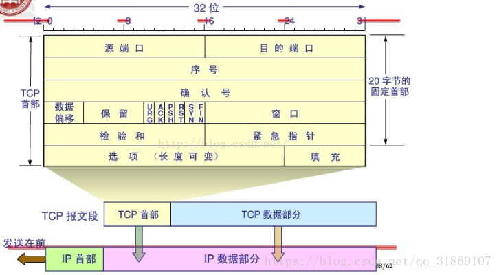

# tcp协议结构和机制详解

## tcp 协议包体

## tcp滑动窗口

#### 一、ack定义

- TCP协议中，接收方成功接收到数据后，会回复一个ACK数据包，表示已经确认接收到ACK确认号前面的所有数据。

  ACK字段长度为32位，能表示0~2^32-1之间的值。

- 发送方在一定时间内没有收到服务端的ACK确认包后，就会重新发送TCP数据包。发送方收到了ACK，表明接收方已经接收到数据，保证了数据的可靠达到。

- 接收方在接收到数据后，不是立即会给发送方发送ACK的。这可能由以下原因导致：

  - 1、收到数据包的序号前面还有需要接收的数据包。因为发送方发送数据时，并不是需要等上次发送数据被Ack就可以继续发送TCP包，而这些TCP数据包达到的顺序是不保证的，这样接收方可能先接收到后发送的TCP包（注意提交给应用层时是保证顺序的）。

  - 2、为了降低网络流量，ACK有延迟确认机制。
  - 3、ACK的值到达最大值后，又会从0开始。

- ACK延迟确认机制

  接收方在收到数据后，并不会立即回复ACK,而是延迟一定时间。一般ACK延迟发送的时间为200ms，但这个200ms并非收到数据后需要延迟的时间。系统有一个固定的定时器每隔200ms会来检查是否需要发送ACK包。这样做有两个目的。

  - 1、这样做的目的是ACK是可以合并的，也就是指如果连续收到两个TCP包，并不一定需要ACK两次，只要回复最终的ACK就可以了，可以降低网络流量。

  - 2、如果接收方有数据要发送，那么就会在发送数据的TCP数据包里，带上ACK信息。这样做，可以避免大量的ACK以一个单独的TCP包发送，减少了网络流量。

    

#### 二、窗口滑动和拥塞控制

​	TCP的滑动窗口主要有两个作用，一是提供TCP的可靠性，二是提供TCP的流控特性。同时滑动窗口机制还体现了TCP面向字节流的设计思路。

- 可靠：对发送的数据进行确认

- 流控制：窗口大小随链路变化。

#### 一、tcp窗口机制

​	tcp中窗口大小是指tcp协议一次传输多少个数据。**因为TCP是一个面向连接的可靠的传输协议，既然是可靠的就需要对传输的数据进行确认。**TCP的窗口机制有两种，一种是固定窗口大小，另一种是滑动窗口。数据在传输时,TCP会对所有数据进行编号，发送方在发送过程中始终保持着一个窗口，只有落在发送窗口内的数据帧才允许被发送；同时接受方也始终保持着一个接收窗口，只有落在窗口内的数据才会被接收。这样通过改变发送窗口和接收窗口的大小就可以实现流量控制。

#### 二、tcp窗口大小

​	tcp的窗口滑动技术通过动态改变窗口的大小来调节两台主机之间数据传输。每个TCP/IP主机支持全双工数据传输，因此TCP有两个滑动窗口，一个用于接收数据，一个用于发送数据。接收方设备要求窗口大小为0时，表明接收方已经接收了全部数据，或者接收方应用程序没有时间读取数据，要求暂停发送。

​	TCP在传送数据时，第一次发数据发送方的窗口大小是由链路带宽决定的，但是接受方在接收到发送方的数据后，返回ack确认报文，同时也告诉了发送方自己的窗口大小，此时发送发第二次发送数据时，会改变自己的窗口大小和接受方一致。

​	当窗口过大时，会导致不必要的数据来拥塞我们的链路，但是窗口太小时，会造成很大的延时，比如为1时，发送方没发送一个数据，接受方就会返回一个ack报文，在发送方未接收到接受方的确认报文ack之前不会进行下一次发送。**当链路变好了或者变差了这个窗口还会发生变话，并不是第一次协商好了以后就永远不变了。**

#### 三、窗口滑动协议

​	是TCP使用的一种流量控制方法。该协议允许发送方在停止并等待接收确认报文前可以连续发送多个分组。由于发送方不必每发一个分组就停下来等待确认，因此该协议可以加速数据的传输。 只有在接收窗口向前滑动时（与此同时也发送了确认），发送窗口才有可能向前滑动。收发两端的窗口按照以上规律不断地向前滑动，因此这种协议又称为滑动窗口协议。

------

- [目录](pre.md)

- [上一章](3.1.md)

  

